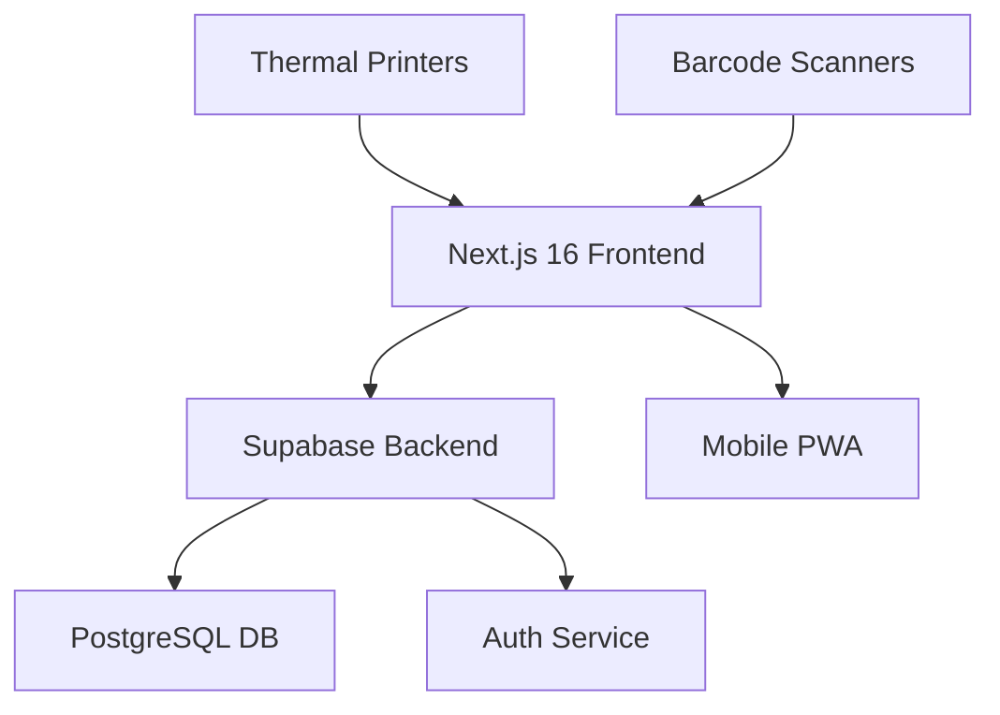

# 🏭 Colamarc WMS
> **Next-Generation Warehouse Management System**

<div align="center">


A cutting-edge, high-performance warehouse management system engineered for modern logistics operations. Built with **Next.js 16**, **Tailwind CSS v4**, and **Supabase**, featuring a sleek White & Blue UI designed for maximum operational efficiency.

[▶️ Live Demo](#) · [📖 Documentation](#) · [🚀 Quick Start](#-getting-started)

</div>

---

## ✨ Why Colamarc WMS?

🔥 **Lightning-Fast Operations** - Real-time inventory tracking with sub-second response times  
📱 **Mobile-First Design** - Works seamlessly on tablets, phones, and desktop devices  
🔒 **Enterprise-Grade Security** - Role-based access control with Supabase RLS  
🎯 **Smart Automation** - FEFO picking, wave management, and route optimization  
📊 **Advanced Analytics** - Real-time dashboards and comprehensive reporting

## 🚀 Core Features

<div align="center">

| 📊 **Dashboard**   | 📦 **Inventory**     | 🎯 **Picking**   | 🚚 **Shipping**     |
| ----------------- | ------------------- | --------------- | ------------------ |
| Real-time metrics | Lot tracking        | FEFO algorithm  | Wave management    |
| Activity feeds    | Expiry alerts       | Mobile scanning | Route optimization |
| Low stock alerts  | Smart replenishment | Batch picking   | PWA for drivers    |

</div>

### 🎯 **Dashboard & Analytics**
- **Live Metrics**: Real-time inventory overview with total products, low stock alerts, and quantity tracking
- **Activity Feed**: Instant visibility into all warehouse operations
- **Smart Alerts**: Proactive notifications for critical inventory levels

### 📦 **Master Data Management**
- **Product Catalog**: Complete CRUD operations with SKU tracking, categorization, and minimum stock levels
- **Location Intelligence**: Hierarchical location system (Zones → Aisles → Racks → Levels → Bins)
- **Real-time Sync**: Seamless Supabase integration for instant data updates

### 🔍 **Advanced Inventory Tracking**
- **Lot Management**: Track manufacturing dates, expiry dates, and lot numbers
- **FEFO Algorithm**: First-Expire-First-Out picking system with intelligent recommendations
- **Visual Dashboard**: Color-coded inventory status (✅ OK, ⚠️ Expiring Soon, ❌ Expired)
- **Smart Analytics**: Predictive expiry tracking and automated replenishment suggestions

### 📱 **Smart Mobile Operations**
- **Barcode/QR Scanning**: Integrated `html5-qrcode` and `react-qr-reader` for mobile devices
- **Step-by-Step Verification**: 100% picking accuracy with real-time validation
- **Offline Capability**: Continue operations even with intermittent connectivity
- **Touch-Optimized UI**: Designed specifically for tablets and rugged warehouse devices

### 👥 **Enterprise Security & Roles**
Robust role-based access control powered by Supabase Row Level Security:

| Role            | 🎯 Focus              | 🔑 Permissions                                  |
| --------------- | -------------------- | ---------------------------------------------- |
| **Super Admin** | Full system control  | All operations, user management, approvals     |
| **Manager**     | Operations oversight | Reports, approvals, task assignments           |
| **Picker**      | Order fulfillment    | Mobile picking, task execution, inventory view |
| **Packer**      | Shipping preparation | Packing workflows, shipping operations         |

### 🔄 **Smart Workflows**
- **Approval System**: Stock adjustments require managerial approval with audit trails
- **Wave Picking**: Aggregate multiple orders into optimized picking waves
- **Route Optimization**: Alphanumeric location sorting for efficient warehouse paths
- **Put-to-Wall Sorting**: Visual dashboards for accurate order consolidation

### 🚚 **Fleet Management & Delivery**
- **Dispatch Dashboard**: Map orders to vehicles and drivers efficiently
- **Thermal Labels**: Auto-generated A6 shipping labels with QR codes
- **Driver PWA**: Mobile app for route manifests and proof of delivery
- **Real-time Tracking**: Live delivery status updates and notifications

### 🎨 **Premium User Experience**
- **Custom Notifications**: Elegant toast system replacing browser alerts
- **Consistent Iconography**: `lucide-react` icons throughout the application
- **Dynamic Navigation**: Role-aware sidebar that adapts to user permissions
- **Responsive Design**: Flawless experience across all device sizes
- **Micro-interactions**: Smooth animations and transitions for enhanced usability

---

## � Quick Start

<div align="center">

### ⚡ One-Command Setup

```bash
git clone https://github.com/MarkeloPuangpoo/WMS.git && cd wms && npm install && npm run dev
```

[📖 Detailed Setup Guide](#-detailed-setup) · [🔑 Demo Accounts](#-demo-accounts-)

</div>

### 📋 Prerequisites
- ✅ **Node.js 18+** - Latest LTS version recommended
- ✅ **Supabase Account** - Free tier works perfectly
- ✅ **Git** - For version control

### 🛠 Detailed Setup

<details>
<summary>📖 Click to expand setup instructions</summary>

#### **Step 1: Clone & Install**
```bash
git clone https://github.com/MarkeloPuangpoo/WMS.git
cd wms
npm install
```

#### **Step 2: Environment Configuration**
```bash
cp .env.example .env.local
# Edit .env.local with your Supabase credentials
```

Required environment variables:
```env
NEXT_PUBLIC_SUPABASE_URL=your_supabase_url
NEXT_PUBLIC_SUPABASE_ANON_KEY=your_supabase_anon_key
```

#### **Step 3: Database Setup**
Run the master schema in your Supabase SQL Editor:
- 📁 `supabase/master_schema_full.sql`
- ✨ Creates all tables, seeds demo data, sets up RBAC

#### **Step 4: Launch Application**
```bash
npm run dev
```
Visit `http://localhost:3000` and start managing your warehouse!

</details>

### 🔑 Demo Accounts

<div align="center">

🎯 **Test the system with our pre-configured demo accounts**

**Universal Password**: `password123`

| Role              | 📧 Email                | 🎯 Purpose            | 🚀 Features                      |
| ----------------- | ---------------------- | -------------------- | ------------------------------- |
| **👑 Super Admin** | `admin@colamarc.com`   | Full system testing  | All features, user management   |
| **📊 Manager**     | `manager@colamarc.com` | Operations oversight | Reports, approvals, analytics   |
| **📦 Picker**      | `picker@colamarc.com`  | Mobile operations    | Barcode scanning, picking flows |
| **📤 Packer**      | `packer@colamarc.com`  | Shipping workflows   | Packing, label generation       |

</div>

<details>
<summary>🔐 Security Features Tested</summary>

- ✅ **Row Level Security** - Each role sees only their data
- ✅ **Permission Boundaries** - Strict access control enforcement
- ✅ **Audit Trails** - Complete action logging
- ✅ **Session Management** - Secure authentication flows

</details>

---

## 🏗 Technical Architecture

<div align="center">



</div>

### 🛠 Core Technologies

| 🎯 **Frontend**  | ⚙️ **Backend**  | 🗄️ **Database**          | 🔐 **Security**     |
| --------------- | -------------- | ----------------------- | ------------------ |
| Next.js 16      | Supabase       | PostgreSQL              | Row Level Security |
| Tailwind CSS v4 | Server Actions | Real-time Subscriptions | JWT Auth           |
| Lucide React    | API Routes     | Stored Procedures       | Role-Based Access  |
| TypeScript      | Edge Functions | Triggers & Hooks        | Audit Logging      |

### 📱 Mobile & Hardware Integration
- **Scanning Libraries**: `@zxing/library`, `html5-qrcode`, `react-qr-reader`
- **Barcode Generation**: `react-barcode`, `qrcode.react`
- **PWA Capabilities**: Service workers, offline support, camera access
- **Thermal Printing**: Optimized label generation for Zebra/Dymo printers

### 🚀 Performance Features
- **Real-time Updates**: Live inventory changes via Supabase subscriptions
- **Optimized Queries**: Efficient database indexing and query patterns
- **Caching Strategy**: Smart client-side caching for offline operations
- **Bundle Optimization**: Next.js automatic code splitting and lazy loading

---

## 📊 Project Status & Roadmap

<div align="center">

| 🎯 **Current Version** | 🚀 **Status**         | 📈 **Progress** |
| --------------------- | -------------------- | -------------- |
| **v0.1.0**            | 🟢 Active Development | 85% Complete   |

</div>

### ✅ Completed Features
- [x] Core dashboard and analytics
- [x] Product and location management
- [x] Lot tracking and FEFO picking
- [x] Mobile barcode scanning
- [x] Role-based access control
- [x] Stock adjustment workflows
- [x] Wave and batch picking
- [x] Fleet management system
- [x] Driver PWA application

### 🚧 Upcoming Features
- [ ] Advanced reporting and BI dashboard
- [ ] API integrations (ERP, accounting systems)
- [ ] Multi-warehouse support
- [ ] AI-powered demand forecasting
- [ ] Voice picking capabilities
- [ ] IoT sensor integration

---

## 🤝 Contributing

We welcome contributions! Whether you're fixing bugs, adding features, or improving documentation, we'd love your help.

### 🛠 Development Workflow
1. **Fork** the repository
2. **Create** a feature branch: `git checkout -b feature/amazing-feature`
3. **Commit** your changes: `git commit -m 'Add amazing feature'`
4. **Push** to the branch: `git push origin feature/amazing-feature`
5. **Open** a Pull Request

### 📋 Code Standards
- Follow TypeScript best practices
- Use Tailwind CSS for styling
- Write meaningful commit messages
- Add tests for new features
- Update documentation when needed


<div align="center">

**🏭 Built with ❤️ by [Colamarc](https://colamarc.com)**

*Empowering warehouses with intelligent automation*

[MIT License](LICENSE) · © 2024 Colamarc. All rights reserved.

</div>
